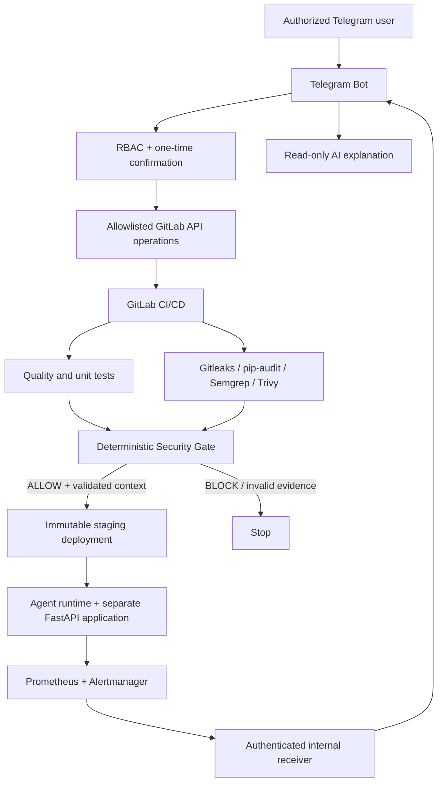

# AI DevSecOps Agent - Telegram-Controlled CI/CD & Security Automation

A staging-focused cybersecurity project that lets authorized users control predefined **GitLab CI/CD** workflows from **Telegram**, review security results, request bounded AI explanations, and deploy validated container images to staging. A separate **Real FastAPI application** provides an end-to-end deployment and monitoring target.

> **Validation scope:** Academic/lab staging environment only. Telegram production deployment is disabled; no live production deployment is claimed. The deterministic Security Gate makes security decisions, **not** the AI model.

## Architecture



**GitLab** remains the operational CI/CD source of truth and hosts the container images. **GitHub** is the portfolio-facing source-code mirror. GitHub Actions was not the CI/CD platform used for the tests described here.

## Implemented features

| Area | Capability |
| --- | --- |
| Telegram | `/start`, `/help`, `/status`, `/logs`, `/run_pipeline`, `/retry_pipeline`, `/scan`, `/cancel_pipeline`, `/explain`, `/explain_security`, `/deploy_staging` |
| Authorization | Deny-by-default Viewer / Operator / Admin roles; time-limited one-time confirmation for sensitive operations |
| CI/CD | Quality, automated tests, secret/dependency/SAST/filesystem/image scans, deterministic gate, staging validation and deployment |
| AI | Explanations from normalized, bounded evidence; no authority to authorize users, change gate results or deploy independently |
| Deployment | Immutable commit-SHA Docker images, health verification and controlled rollback in staging |
| Monitoring | Prometheus + Alertmanager; authenticated internal receiver; bounded Telegram alerts |
| Integration target | Separate FastAPI app with PostgreSQL, deployed and monitored in staging |

### Telegram roles

- **Viewer:** `/start`, `/help`, `/status`.
- **Operator:** Viewer commands plus `/logs`, `/explain`, `/explain_security`, `/run_pipeline`, `/retry_pipeline`, `/scan`.
- **Admin:** Operator commands plus `/cancel_pipeline` and `/deploy_staging`.

GitLab project, ref, scanner profile and deployment environment are constrained server-side. Telegram does not offer arbitrary shell execution or a production deployment command.

## Security model

Security scanner reports are normalized and evaluated by an independent, deterministic Policy Engine. The configured policy blocks **HIGH**, **CRITICAL** and **UNKNOWN** findings and fails closed when mandatory evidence is invalid. Deployment validation consumes the gate result; Telegram confirmation and AI explanations cannot bypass it.

Other controls include separate GitLab read/write credentials, webhook authentication and replay resistance, bounded and sanitized logs, non-root/read-only hardened containers, loopback-only staging ingress and internal monitoring services.

An `ALLOW` result applies to the **specific validated pipeline and policy**; it does not mean that a container image has zero vulnerabilities.

## Validated results

| Evidence | Observed result |
| --- | --- |
| Agent staging pipeline [#192](https://gitlab.com/akhyames/ai-telegram-devsecops-agent/-/pipelines/2880137874), commit `ab8de69` | All 13 jobs passed, including `security_gate`, `deploy_staging` and `deploy_staging_monitoring` (24 Sep 2026) |
| Agent Security Gate, pipeline #186, commit `383badf8` | `ALLOW (0/0 blocking findings)` with Trivy baseline delta `0` |
| Real FastAPI pipeline #28, commit `60008c98` | Quality, tests, security scans, Security Gate and staging deployment passed |
| Telegram bot | Role-specific `/help`; `/status` returned the successful pipeline at `ab8de69` |
| Monitoring | A controlled staging outage produced `FIRING`; recovery produced `RESOLVED` in Telegram |

The GitLab projects and linked traces are **private**; readers without access may not be able to open the pipeline links. Curated screenshots can provide portfolio evidence without publishing private CI artifacts.

An intermittent `/status` issue was investigated and subsequent spot checks succeeded. The separate deployment-completion notification was not observed in Telegram and remains an open follow-up; the successful CI deployment job should not be confused with confirmation of Telegram delivery.

## Visual evidence

### Architecture


### Telegram control


### CI/CD and security validation


### Monitoring and runtime


See the [complete screenshot evidence gallery](docs/screenshots/README.md) for the full curated set.

## Development and reproducibility

The implementation uses **Python 3.12**, **FastAPI**, **Docker / Compose**, **GitLab Runner** and an Ubuntu Server 24.04 lab VM. From the project root, the local quality and test checks can be run with:

```bash
python -m venv .venv
# Install development dependencies using the virtual environment's Python.
# Linux/macOS:
.venv/bin/python -m pip install -e ".[dev]"
.venv/bin/python -m pytest -q
.venv/bin/python -m ruff format --check .
.venv/bin/python -m ruff check .
```

On Windows PowerShell, use `& .\.venv\Scripts\python.exe -m pip install -e ".[dev]"` and replace `python` above with `& .\.venv\Scripts\python.exe` for the remaining checks. This avoids depending on PowerShell activation policy.

**Full Telegram/GitLab integration is environment-specific.** It requires separately provisioned credentials, protected CI variables, the Runner, approved Docker target, and authenticated webhook/monitoring receivers. Do not commit `.env`, private SSH keys, bot tokens, or deployment secrets. Do not expose local-only endpoints publicly for a demo.

## Documentation

| Document | Purpose |
| --- | --- |
| [System Architecture](docs/architecture.md) | Components, trust boundaries and end-to-end architecture |
| [Security Overview](docs/security-overview.md) | Security controls, RBAC, Security Gate and deployment boundaries |
| [Threat Model](docs/threat-model.md) | Threats, mitigations, trust boundaries and residual risks |
| [Telegram Operations Guide](docs/telegram-operations-guide.md) | Commands, roles, confirmations and staging deployment workflow |
| [Installation & Configuration](docs/installation-configuration.md) | Secure setup and environment configuration |
| [Deployment Runbook](docs/deployment-runbook.md) | Deployment validation, health checks and rollback procedures |
| [Monitoring Runbook](docs/monitoring-runbook.md) | Prometheus, Alertmanager and Telegram alert operations |
| [Backup & Recovery](docs/backup-recovery.md) | Recovery and rollback procedures |
| [Evidence Index](docs/evidence-index.md) | Technical validation and reproducible project evidence |
## Repository status and evidence

This GitHub repository contains the reviewed source-code mirror used for portfolio and final delivery. The operational CI/CD source of truth remains the private GitLab project, where the demonstrated pipelines were executed. This GitHub repository does not use GitHub Actions for the documented CI/CD workflow.

## Limitations

- Only the **staging/lab** environment was deployed and validated; production is intentionally unprovisioned.
- A local SSH-tunnel URL such as `http://127.0.0.1:18001/` is accessible only from the machine running the tunnel; it is not a public demo URL.
- Telegram, GitLab, the container registry and the local AI provider are operational dependencies.
- AI output is explanatory and may be unavailable or inaccurate; it cannot change authorization or gate decisions.

---

**Focus:** DevSecOps | GitLab CI/CD | Telegram | Security Automation | FastAPI | Docker | Prometheus | Alertmanager
