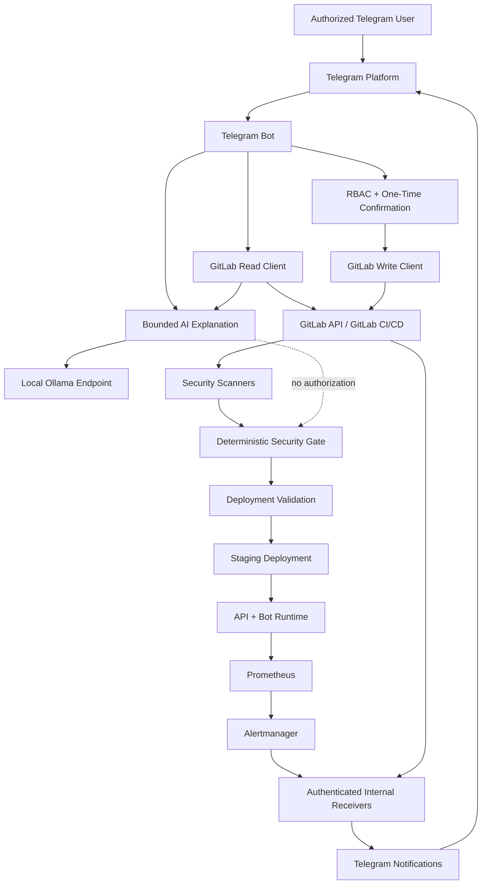
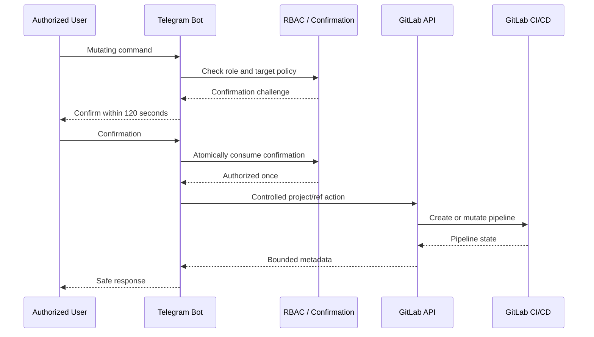
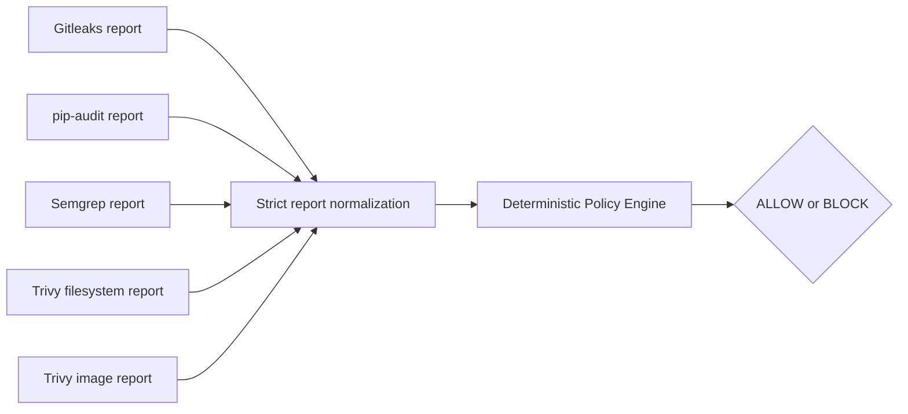
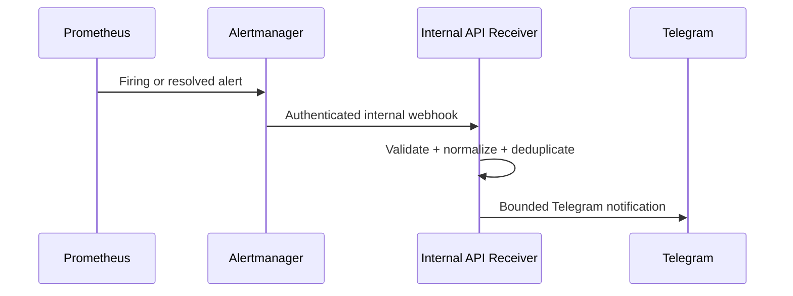

# System Architecture

## 1. Purpose

This document describes the validated system architecture of the **AI DevSecOps Agent Controlled via Telegram**.

It consolidates the final implementation into one architecture reference without replacing the specialized security, deployment, monitoring, recovery, installation, or Telegram operations documentation.

The architecture is designed around one central rule:

> Security authorization is deterministic. The AI layer can explain bounded, normalized evidence but cannot authorize actions, override the Security Gate, or perform deployment decisions.

The validated live environment is **staging**. Production-aware CI and deployment definitions remain tracked, but Telegram production deployment commands are disabled. Production remains intentionally unprovisioned and is not claimed as a validated live production environment.

---

## 2. Architectural Goals

The final architecture is designed to:

- expose DevSecOps operations through Telegram;
- preserve deny-by-default authorization;
- separate read and write GitLab capabilities;
- constrain privileged targets server-side;
- require one-time confirmation for mutating operations;
- make CI security checks blocking;
- keep the deterministic Policy Engine and Security Gate authoritative;
- deploy immutable commit-SHA images only;
- verify runtime health before accepting a release;
- isolate monitoring from core application rollback;
- provide authenticated, bounded notifications;
- keep AI read-only and non-authoritative;
- minimize exposed host services;
- preserve auditable, fail-closed behavior.

---

## 3. System Context



The diagram is conceptual. Detailed executable behavior remains defined by the tracked source files and GitLab CI configuration.

---

## 4. Main Runtime Components

### 4.1 Telegram Bot

The Telegram Bot is the primary user-facing control plane.

It provides:

- status retrieval;
- bounded job-log retrieval;
- full pipeline launch;
- security scan launch;
- eligible pipeline retry;
- eligible pipeline cancellation;
- staging deployment through `/deploy staging` and `/deploy_staging`;
- AI-assisted explanation of normalized evidence.

The Bot uses deterministic authorization before command execution.

The polling runtime is implemented under the `bot/` package, with the Telegram runtime invoking `application.run_polling(...)`.

The Bot does not expose an unrestricted shell or arbitrary GitLab target selector.

### 4.2 FastAPI Application Service

The application/API service is implemented through the `sample_app/` package.

The FastAPI application is created in:

```text
sample_app/main.py
```

It includes application health and metrics behavior plus routers for:

- authenticated GitLab webhook intake;
- authenticated internal monitoring alert intake.

Important API-side functions include:

- webhook authentication and replay protection;
- bounded request handling;
- pipeline event normalization;
- deployment evidence retrieval;
- Security Gate evidence retrieval;
- monitoring alert normalization;
- Telegram notification triggering.

The staging API is exposed only through the validated loopback host binding.

### 4.3 AI Agent

The AI component is implemented under:

```text
agent/
```

The validated provider boundary is a fixed local Ollama capability.

The AI path receives normalized, sanitized, bounded evidence.

It may:

- explain pipeline failures;
- explain Security Gate results;
- help an authorized operator understand validated evidence.

It may not:

- make Security Gate decisions;
- convert `BLOCK` to `ALLOW`;
- select privileged deployment targets;
- execute GitLab write operations;
- deploy applications;
- bypass RBAC or confirmation.

The AI is therefore a diagnostic layer, not a security authority.

### 4.4 GitLab Integration

GitLab is the CI/CD and pipeline control plane.

The architecture separates GitLab responsibilities into distinct read and write paths.

#### Read path

The read-only path is used for operations such as:

- pipeline status;
- bounded job logs;
- Security Gate result retrieval;
- deployment evidence retrieval.

The primary read credential is configured separately from the write credential.

#### Write path

The controlled write path is used for explicitly authorized actions such as:

- launching the allowlisted pipeline;
- launching the fixed security scan profile;
- retrying an eligible pipeline;
- canceling an eligible pipeline;
- starting a deployment workflow.

The write configuration constrains the GitLab API origin, project, and default ref.

Read and write targets are validated for consistency before controlled pipeline mutations.

---

## 5. Telegram Authorization Architecture

Authorization is deny-by-default.

The validated roles are:

| Role | Main capability level |
|---|---|
| Viewer | Read-only basic status |
| Operator | Read operations plus controlled pipeline/scan actions |
| Admin | Operator capabilities plus cancellation and deployment |

Mutating actions require deterministic confirmation.

Validated confirmation properties include:

- one-time use;
- 120-second TTL;
- replay resistance;
- target binding;
- environment/action binding where applicable;
- atomic consumption;
- bounded pending-confirmation state.

A Telegram confirmation is not a reusable authorization token.

---

## 6. Controlled Telegram-to-GitLab Flow



Server-side target control prevents users from turning Telegram input into arbitrary project, ref, pipeline, or deployment target selection.

---

## 7. CI/CD Architecture

The GitLab pipeline combines:

- runner verification;
- code quality;
- automated tests;
- security scanners;
- immutable image construction;
- image security validation;
- deterministic Security Gate evaluation;
- optional deployment validation;
- controlled deployment;
- staging monitoring deployment.

The standard non-deployment validation pipeline contains the following ten validated jobs:

```text
runner_connectivity
ruff_quality
unit_tests
container_image
secret_scan
dependency_scan
sast_scan
trivy_filesystem_scan
trivy_image_scan
security_gate
```

Deployment jobs are only introduced when the required deployment workflow conditions are satisfied.

---

## 8. Security Scanner Architecture

The security layer uses independent scanners with normalized output.

Validated scanners include:

| Security control | Implementation |
|---|---|
| Secret detection | Gitleaks |
| Dependency audit | pip-audit |
| SAST | Semgrep |
| Filesystem/configuration scan | Trivy filesystem |
| Container image scan | Trivy image |

Scanner output is treated as evidence, not direct authorization.

Reports are normalized before the deterministic Policy Engine makes the final decision.

Malformed or unavailable mandatory security evidence fails closed.

---

## 9. Deterministic Policy Engine and Security Gate

The Policy Engine is implemented under:

```text
policy_engine/
```

The CI integration is implemented through:

```text
deployment/ci_gate.py
security-policy.toml
.gitlab-ci.yml
```

The final security decision is deterministic.

The validated blocking policy treats:

```text
HIGH
CRITICAL
UNKNOWN
```

as blocking conditions.



The AI layer is outside this authorization path.

---

## 10. Deployment Dependency Chain

The validated deployment architecture is:

```text
security scanners
→ security_gate
→ security-gate-result.json
→ deployment validation
→ deployment job
```

For staging, the relevant chain includes:

```text
validate_staging_deployment
→ deploy_staging
→ deploy_staging_monitoring
```

A blocked Security Gate cannot progress to deployment through the normal validated CI dependency chain.

The deployment script is not an alternate Security Gate.

---

## 11. Immutable Release Architecture

Deployment identity is based on:

```text
<GitLab Registry repository>:<40-character commit SHA>
```

Mutable release tags such as `latest` are not part of the validated release identity.

The deployment script validates:

- target environment;
- full commit SHA;
- image repository boundary;
- exact environment/Compose override pairing;
- authorized remote Docker target;
- current/previous release identity;
- container count;
- image equality;
- Docker health;
- API readiness;
- Bot runtime state.

The API and Bot must run the same expected immutable image before the release is accepted.

---

## 12. Remote Deployment Boundary

Deployment scripts use the authorized remote Docker target:

```text
DOCKER_HOST=ssh://deployment-target
```

The validated Compose project follows:

```text
ai-devsecops-<environment>
```

The base Compose definition supplies shared runtime hardening.

Environment-specific overrides provide staging or production-specific configuration.

For staging, the API host publishing remains loopback-only.

No inbound Prometheus or Alertmanager host ports are required.

---

## 13. Runtime Hardening Architecture

The validated application containers apply layered hardening including:

- non-root execution;
- read-only root filesystem;
- dropped Linux capabilities;
- `no-new-privileges`;
- health checks;
- bounded logging;
- restart policy;
- minimized host exposure.

Deployment verification treats a merely running container as insufficient.

The expected services must also satisfy validated health and immutable-image checks.

---

## 14. Rollback Architecture

Before replacing an existing release, the release process attempts to identify a valid previous immutable release.

A previous release is accepted as a rollback candidate only when the existing runtime is internally consistent.

If the new release fails verification and a valid previous release exists, rollback uses the same controlled deployment and verification mechanism.

Rollback is therefore not a blind container restart.

Important result states include:

```text
DEPLOYMENT_RESULT=deployed
DEPLOYMENT_RESULT=configuration_failed
DEPLOYMENT_RESULT=previous_release_invalid
DEPLOYMENT_RESULT=failed

ROLLBACK=not_required
ROLLBACK=required

ROLLBACK_RESULT=succeeded
ROLLBACK_RESULT=unavailable
ROLLBACK_RESULT=failed
```

Even a successful rollback does not turn the failed target release into a successful deployment job.

---

## 15. Monitoring Architecture

The validated monitoring stack contains:

- Prometheus v3.13.2;
- Alertmanager v0.33.1;
- tracked Prometheus configuration;
- tracked alert rules;
- tracked Alertmanager configuration;
- authenticated internal alert receiver;
- outbound Telegram notification delivery.

Prometheus scrapes:

```text
api:8000
```

with validated:

```text
scrape_interval: 15s
evaluation_interval: 15s
```

The monitoring network is internal.

Expected validated network state includes:

```text
PROMETHEUS_HOST_PORT_PUBLISHED=false
ALERTMANAGER_HOST_PORT_PUBLISHED=false
MONITORING_NETWORK_INTERNAL=true
PROMETHEUS_TARGET_UP=true
```

---

## 16. Alert Flow



Validated alert rules include:

```text
SampleAppUnavailable
SampleAppHighServerErrors
SampleAppHighLatency
```

Both firing and resolved notification behavior have been validated.

---

## 17. Monitoring and Core Rollback Separation

Monitoring is deliberately separated from core deployment rollback semantics.

The architectural invariant is:

> Monitoring failure must never trigger automatic rollback of a healthy application release.

Therefore:

```text
core staging deployment success
        |
        v
monitoring deployment
        |
        +-- success → monitoring operational
        |
        +-- failure → recover monitoring independently
```

This avoids turning a telemetry failure into an unnecessary application outage.

---

## 18. GitLab Webhook Architecture

The FastAPI service exposes an authenticated GitLab webhook path.

Validated webhook controls include:

- fixed GitLab instance boundary;
- allowed event types;
- bounded request body;
- signed request verification;
- timestamp freshness validation;
- replay protection;
- bounded replay state;
- rate limiting;
- normalized pipeline event schema;
- safe failure responses.

Pipeline events may trigger bounded Telegram notifications.

Webhook intake does not bypass the Policy Engine or GitLab CI dependency chain.

---

## 19. Monitoring Receiver Architecture

Alertmanager delivers events to the internal receiver:

```text
http://api:8000/internal/monitoring/alerts
```

The receiver is authenticated.

The receiver credential is provisioned without being printed into documentation or ordinary operational output.

Alertmanager is configured to send resolved events as well as firing events.

---

## 20. Notification Architecture

The system can deliver Telegram notifications for validated pipeline, security, deployment, and monitoring events.

Notification data is intentionally bounded.

The architecture avoids using raw CI traces or unrestricted payloads as notification content.

Relevant evidence is normalized before user-facing output.

---

## 21. Bounded Log and Evidence Handling

The system uses bounded retrieval and rendering for troubleshooting data.

For Telegram job logs, the validated operational limits include:

- up to 20 pipeline jobs considered;
- up to 262,144 bytes of GitLab trace input;
- up to 40 rendered lines;
- up to 3,000 rendered characters;
- sensitive-pattern redaction;
- explicit truncation indication.

Security Gate, deployment, and webhook evidence readers also enforce structured validation rather than blindly trusting upstream payloads.

---

## 22. Trust Boundaries

The final architecture contains the following principal trust boundaries:

| Boundary | Security purpose |
|---|---|
| Telegram user → Bot | Identity and RBAC enforcement |
| Bot → GitLab read API | Least-privilege evidence retrieval |
| Bot → GitLab write API | Explicit controlled mutation |
| Bot → AI | Sanitized, bounded, non-authoritative explanation |
| Scanner artifacts → Policy Engine | Strict evidence normalization |
| GitLab webhook → API | Authentication, freshness, replay defense |
| GitLab CI → staging Docker target | Controlled immutable deployment |
| Prometheus/Alertmanager → API | Internal authenticated alert delivery |
| Runtime credentials → services | Secret separation and least privilege |

Detailed threat analysis is maintained in:

```text
docs/threat-model.md
docs/security-overview.md
```

---

## 23. Credential Separation

The architecture separates capabilities instead of using one universal credential.

Important credential classes include:

- GitLab read credential;
- GitLab write credential;
- GitLab webhook signing credential;
- Alertmanager receiver credential;
- Telegram Bot credential;
- deployment SSH identity/configuration;
- local AI configuration.

Runtime secrets are not authoritative source-controlled recovery material.

Git is authoritative for tracked configuration and code, not secret values.

---

## 24. Recovery Architecture

Git-tracked code and configuration are authoritative.

Recovery uses a known-good immutable commit SHA.

The architecture treats:

```text
prometheus_config
alertmanager_config
```

as reconstructable from tracked configuration and deployment logic.

For the current staging environment, loss of monitoring history is acceptable and does not invalidate core application identity.

Detailed recovery procedures are documented in:

```text
docs/backup-recovery.md
```

---

## 25. Production Boundary

Production remains intentionally unprovisioned.

The repository contains production-aware CI and deployment definitions so the architecture can enforce environment separation, but Telegram exposes staging deployment only. The project does not claim:

- a validated live production deployment;
- validated live production monitoring;
- production disaster-recovery certification.

Production is not provisioned merely for demonstration or packaging purposes.

---

## 26. Authoritative Architecture Sources

The main tracked architecture sources include:

```text
README.md
.gitlab-ci.yml
security-policy.toml

bot/
agent/
policy_engine/
sample_app/

deployment/ci_gate.py
deployment/release.sh
deployment/monitoring.sh
deployment/compose.yml
deployment/compose.staging.yml
deployment/compose.production.yml

monitoring/prometheus/prometheus.yml
monitoring/prometheus/alerts.yml
monitoring/alertmanager/alertmanager.yml
```

Operational and security documentation:

```text
docs/security-overview.md
docs/threat-model.md
docs/telegram-operations-guide.md
docs/deployment-runbook.md
docs/monitoring-runbook.md
docs/backup-recovery.md
docs/installation-configuration.md
```

---

## 27. Architecture Invariants

The following invariants define the validated architecture:

1. Unknown Telegram users are denied by default.
2. Privileged actions require the minimum authorized role.
3. Mutating actions require one-time replay-resistant confirmation.
4. GitLab read and write capabilities remain separated.
5. Privileged targets are controlled server-side.
6. Scanner evidence is normalized before policy evaluation.
7. The deterministic Policy Engine and Security Gate are authoritative.
8. The AI cannot authorize, deploy, or override the Security Gate.
9. Deployment uses immutable full commit-SHA image identity.
10. Runtime verification is required before accepting deployment success.
11. Monitoring services remain internally isolated from host exposure.
12. Monitoring failure cannot automatically roll back a healthy application.
13. Credentials are not committed or used as ordinary documentation evidence.
14. Production remains unprovisioned until explicitly provisioned and validated.

---

## 28. Related Documentation

Use this architecture reference together with:

- [`security-overview.md`](security-overview.md) — detailed security controls and invariants;
- [`threat-model.md`](threat-model.md) — threats, trust boundaries, mitigations, and residual risk;
- [`telegram-operations-guide.md`](telegram-operations-guide.md) — user roles, commands, confirmations, and safe operations;
- [`deployment-runbook.md`](deployment-runbook.md) — deployment validation, release verification, and rollback;
- [`monitoring-runbook.md`](monitoring-runbook.md) — Prometheus/Alertmanager deployment and recovery;
- [`backup-recovery.md`](backup-recovery.md) — application and monitoring recovery;
- [`installation-configuration.md`](installation-configuration.md) — installation and configuration boundary.

The companion evidence package will be maintained in:

```text
docs/evidence-index.md
```

once Phase 15.7 evidence packaging is completed.

---

## 29. Current Validated Architecture State

```text
Telegram control plane            validated
RBAC                              validated
One-time confirmation             validated
GitLab read/write separation      validated
Pipeline control                  validated
Security scanning                 validated
Deterministic Security Gate       validated
Read-only AI explanation          validated
Immutable staging deployment      validated
Automatic rollback behavior       validated
Prometheus monitoring             validated
Alertmanager alert routing        validated
Telegram alert lifecycle          validated
Recovery behavior                 validated
Production runtime                intentionally unprovisioned
```

This document represents the validated final architecture at the current Phase 15 packaging state.
