# Visual Evidence

This gallery contains the curated screenshots used to document the validated staging implementation.

## Architecture

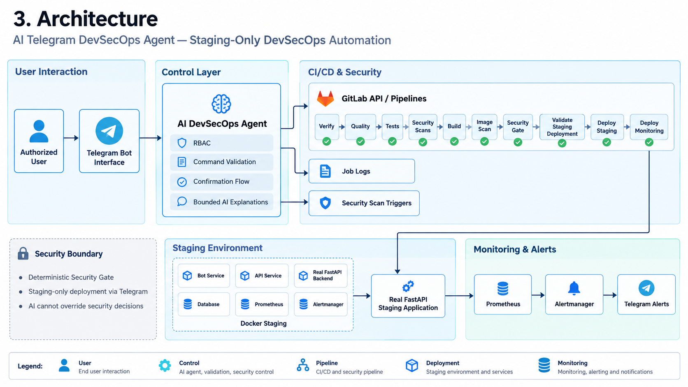

High-level architecture showing Telegram interaction, RBAC/control, GitLab CI/CD and security stages, deterministic Security Gate enforcement, staging deployment, the Real FastAPI workload, and monitoring/alerting.

## Telegram Control

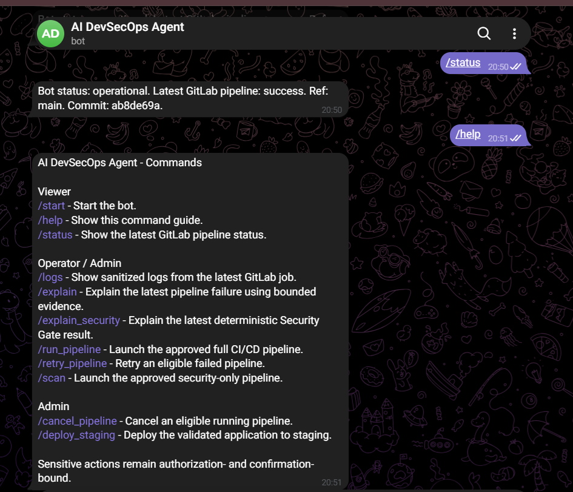

Role-based Telegram command surface and successful pipeline status.

## Agent CI/CD Pipeline

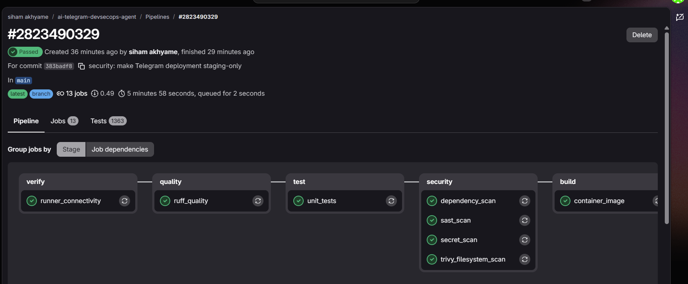

Representative successful Agent pipeline showing quality, tests, security scans and build stages.

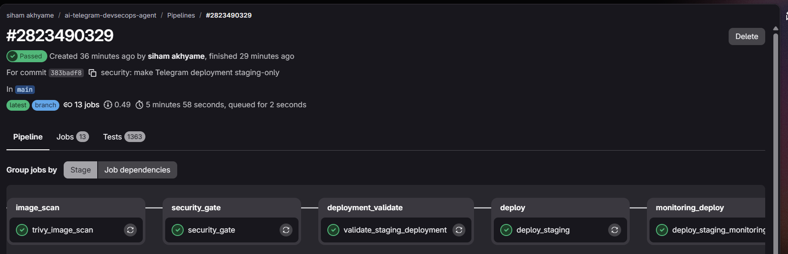

Security Gate, staging validation and deployment stages.

## Deterministic Security Gate

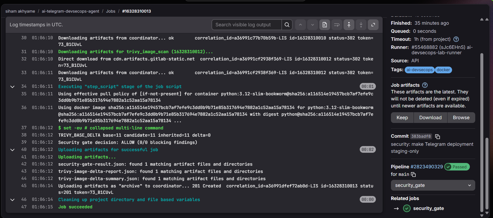

Security Gate evidence showing an `ALLOW` decision for the validated pipeline with zero blocking findings.

## Real FastAPI Integration

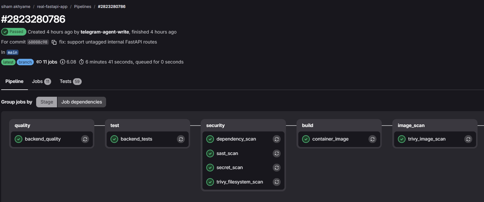

Quality, tests, security scans and build stages for the separate Real FastAPI application.

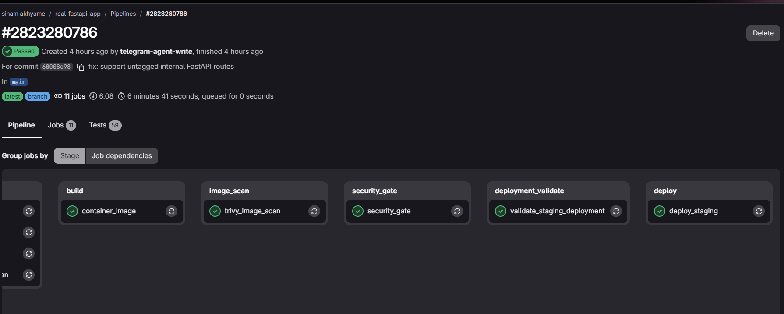

Security Gate, staging validation and deployment for the separate Real FastAPI application.

## Monitoring & Alerting

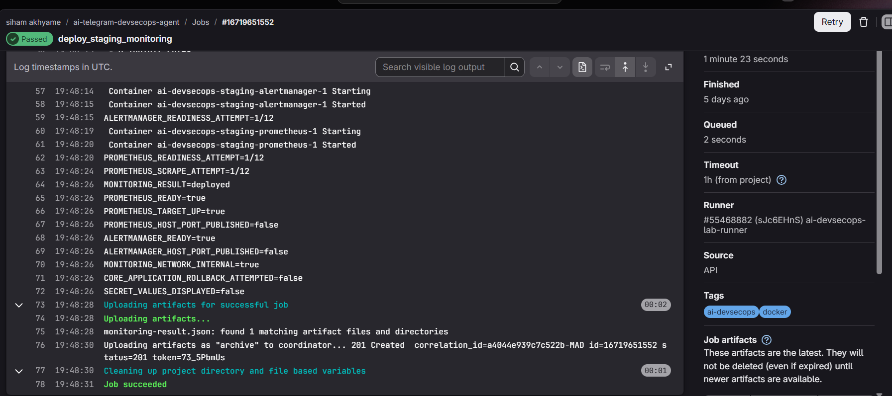

Prometheus and Alertmanager deployment validation, application target UP, internal monitoring network, and no host-published monitoring ports.

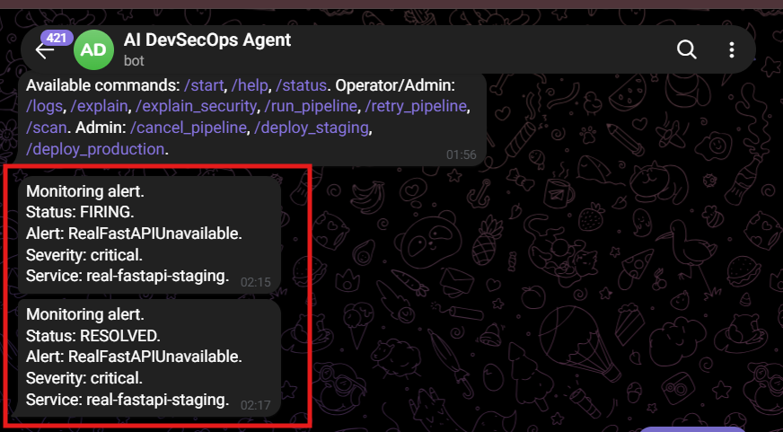

Controlled staging outage producing a `FIRING` alert, followed by `RESOLVED` after service recovery.

## Final Runtime Validation

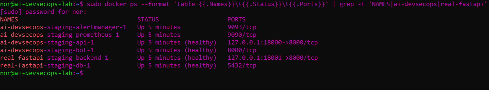

Agent, monitoring and Real FastAPI staging services running with healthy application containers.

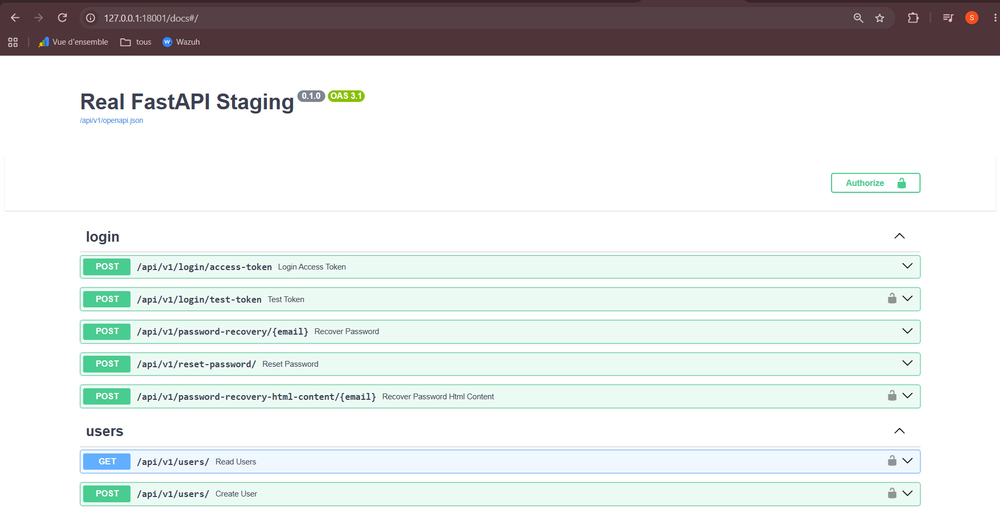

Swagger UI for the deployed Real FastAPI staging application through the controlled SSH tunnel.

> The simple `/health-check/` screenshot was intentionally omitted from this public gallery because the Docker health evidence and Swagger UI provide stronger visual proof.